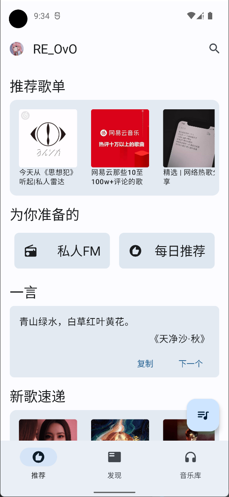
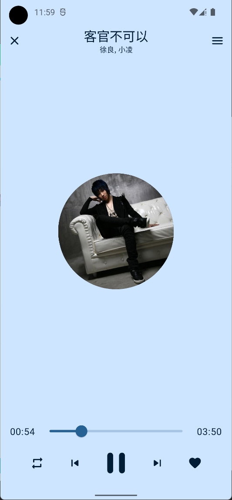

# RainMusic
[](https://github.com/re-ovo/RainMusic/issues)
[](https://github.com/re-ovo/RainMusic/network)
[](https://github.com/re-ovo/RainMusic/stargazers)
[](https://github.com/re-ovo/RainMusic/blob/master/LICENSE)

RainMusic是一个使用 [Jetpack Compose](https://developer.android.com/jetpack/compose) 构建的网易云第三方app,
采用 [Material You](https://m3.material.io/) 设计，专注听歌功能，没有社交功能，还你一个纯净的音乐APP。

## 📦️ 下载安装包
* 开发中，暂时不提供下载，感兴趣的可以自行编译试用

## 👀 注意事项
1. 本APP完全免费，请勿用于商业用途或非法用途，仅供个人学习使用，任何修改版本导致的问题与本人无关
2. 请勿提交任何"破解VIP", "破解灰色歌单" 之类的侵权功能请求或者PR, 此类请求会被直接close
3. 本APP不会实现`黑胶充值功能，注册功能` 等类似敏感功能，请自行使用官方APP完成这类操作
4. 请勿公开传播该APP，喜欢的个人使用就好!

## 🎯 特性
* Material You 设计
* 推荐
* 日推
* 搜索 (WIP)
* 歌单
* 歌词
* 自动签到
* 一言
* 私人FM (WIP)

## 🖼️ 截图展示
| 主页 | 播放器 | 歌词 |
| ----- | ------| ------|
| | |  |

## 📭 常见问题
1. **有没有iOS版?**   
   答: 当然没有，用iOS就和小众app说再见吧
2. **使用这个app有账号安全隐患吗?**   
   答: 本app之和网易官方API通信，欢迎检查代码，同时请在这里下载app，请不要下载来路不明的版本
3. **能否添加评论功能?**   
   答: 不会添加

## 🎲 技术栈
* Jetpack Compose
* Kotlin Flow驱动，无LiveData
* MVVM架构
* Navigation + 单Activity
* Room
* Retrofit
* Hilt
* Androidx Media3

~~快毕业的无业游民, 有无大佬内推~~😅

## 🤩 感谢
* 感谢 [NeteaseCloudMusicApi](https://github.com/Binaryify/NeteaseCloudMusicApi) 项目，本APP的API调用部分大量参考了该项目的代码
* 感谢 [music-java-api](https://github.com/jnwang95/music-java-api) 项目的加密Java实现
* 感谢 [tenapi.cn](https://docs.tenapi.cn/) 的一言API

## 🔭 参与到本项目
如果你懂Jetpack Compose和Kotlin，欢迎提交PR!

## 📡 开源协议
```text
MIT License

Copyright (c) 2021 RERERE

Permission is hereby granted, free of charge, to any person obtaining a copy
of this software and associated documentation files (the "Software"), to deal
in the Software without restriction, including without limitation the rights
to use, copy, modify, merge, publish, distribute, sublicense, and/or sell
copies of the Software, and to permit persons to whom the Software is
furnished to do so, subject to the following conditions:

The above copyright notice and this permission notice shall be included in all
copies or substantial portions of the Software.

THE SOFTWARE IS PROVIDED "AS IS", WITHOUT WARRANTY OF ANY KIND, EXPRESS OR
IMPLIED, INCLUDING BUT NOT LIMITED TO THE WARRANTIES OF MERCHANTABILITY,
FITNESS FOR A PARTICULAR PURPOSE AND NONINFRINGEMENT. IN NO EVENT SHALL THE
AUTHORS OR COPYRIGHT HOLDERS BE LIABLE FOR ANY CLAIM, DAMAGES OR OTHER
LIABILITY, WHETHER IN AN ACTION OF CONTRACT, TORT OR OTHERWISE, ARISING FROM,
OUT OF OR IN CONNECTION WITH THE SOFTWARE OR THE USE OR OTHER DEALINGS IN THE
SOFTWARE.
```